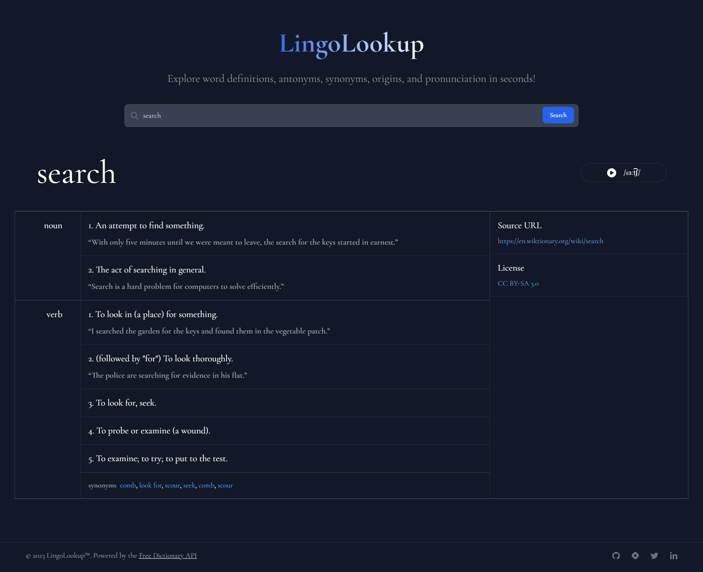

# LingoLookup — Dictionary Web App

LingoLookup is a simple and easy-to-use dictionary app that lets you quickly search for word definitions, synonyms, and antonyms. Try it out at [lingolookup.netlify.app](https://lingolookup.netlify.app).

## Screenshot

## Features

* Search for word definitions, synonyms, and antonyms.
* Play audio pronunciations for the searched word.
* Click on a synonym or an antonym to search for its definition.

## Running Locally

1. Fork this repository
2. Clone your forked repository to your local machine
3. Install dependencies with `npm install`
4. Start the development server with `npm run dev`
5. Open your browser and navigate to `http://localhost:5173`

## Usage

* Visit [lingolookup.netlify.app](https://lingolookup.netlify.app).
* Enter a word in the search bar.
* Press the "Search" button or hit "Enter" to search for the word.
* View the word's definitions, synonyms, and antonyms.
* Click on a synonym or an antonym to search for its definition.
* Click on the speaker icon to hear the word's audio pronunciation (if available).

## Contributing

Any contributions you make are greatly appreciated.

If you encounter any issues with the project, please don't hesitate to [create a new issue](https://github.com/jeremy0x/lingo-lookup/issues/new/choose).
